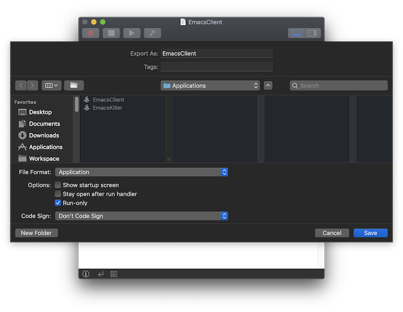
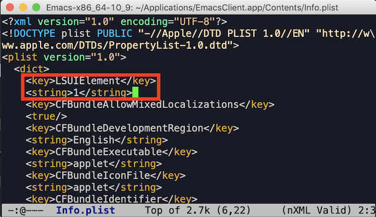

Emacs client/server setup for macOS
----

Using emacsclient makes you less tired for waiting initialization of Emacs instance. This guide is about setup Emacs daemon and client for macOS which is not fully described in [EmacsWiki](https://www.emacswiki.org/emacs/EmacsAsDaemon).

Environment:

* macOS Mojave Version 10.14.5
* GNU Emacs 25.1.1

### 1. Set server-socket-dir

In my case, `--socket-name` should be specified to start emacsclient and deamon process also need the same name as `server-socket-dir`. In the following code, `/tmp/emacs501` ("501" is my choise) is the `--socket-name` as well as the `server-socket-dir`.

```lisp
(setq server-socket-dir "/tmp/emacs501")
```

Put above code in your init.el.

### 2. Create launch script

You don't need to run `emacsclient` in Terminal app. Using [Script Editor](https://developer.apple.com/library/archive/documentation/AppleScript/Conceptual/AppleScriptX/AppleScriptX.html) app, you can make AppleScript and run it by clicking icon in the Dock or Desktop screen. And you don't need to know all about the syntax of AppleScript language to launch emacsclient and Emacs daemon. Run Script Editor app and put below code(`/tmp/emacs501` is your `server-socket-dir`).

```sh
try
	tell application "Terminal"
		do shell script "/Applications/Emacs.app/Contents/MacOS/bin/emacsclient -c --socket-name /tmp/emacs501/server"
	end tell
on error
	tell application "Terminal"
		do shell script "/Applications/Emacs.app/Contents/MacOS/Emacs --daemon"
		do shell script "/Applications/Emacs.app/Contents/MacOS/bin/emacsclient -c --socket-name /tmp/emacs501/server"
	end tell
end try
```

This script first run emacsclient, and if there's an exception, launch Emacs daemon and run emacsclient again. With this, you don't need to run Emacs daemon in Terminal app or M-x `(server-start)` in another Emacs instance. [kevinjfoley](https://gist.github.com/redinger/1394910/c0dc6877c158a13760212dbe10b4abb32ae3c4f8#gistcomment-2561193) shared it and I added `--socket-name` argument.

Then go to File-Export. Select Application as File Format and check Run-only checkbox. Save it into a folder. I created `~/Applications` directory as bellow.



### 3. Hide deamon app in the Dock menu

You can run your emacsclient by clicking the icon you just created. But it makes your Dock messy by creating Emacs icon of daemon instance. You can get rid of this. Open Info.plist file of your app(in my case, `~/Applications/EmacsClient/Contents/Info.plist`), add `LSUIElement` key and `1` as string like following.



`LSUIElement` means the app is an agent and should not appear in the Dock.

### 4. Deal with not terminating issue

There's one more step. I personally put the following code in my init.el to prevent erasing buffers before quiting Emacs either by intention or mistake.

```lisp
(setq confirm-kill-emacs 'yes-or-no-p)
```

But this code also prevent Emacs daemon being terminated in the system shutdown. So I had to manually kill the Emacs daemon(by sending signal: kill -9 PID).

You can just give up the confirm code or at least you can turn on the confirm code when you're in non-daemon mode using `daemonp` function. Like following.

```lisp
(if (daemonp)
    nil
  (setq confirm-kill-emacs 'yes-or-no-p))
```

### References

* https://gist.github.com/redinger/1394910/c0dc6877c158a13760212dbe10b4abb32ae3c4f8
* https://developer.apple.com/library/archive/documentation/General/Reference/InfoPlistKeyReference/Articles/LaunchServicesKeys.html
* https://emacs.stackexchange.com/questions/28431/how-to-check-for-emacs-being-initialized-in-daemon-mode
* https://www.reddit.com/r/emacs/comments/22je26/os_x_emacs_in_daemon_mode_and_emacsclient/
* https://github.com/Tristan79/iBrew/blob/master/source/distro/mac/Info.plist#L5
* https://apple.stackexchange.com/questions/12672/applescript-app-started-prompting-to-run-or-quit-how-can-i-disable-this
* https://stackoverflow.com/questions/23148787/why-emacsclient-cant-find-socket-after-executing-emacs-daemon
* https://www.emacswiki.org/emacs/EmacsClient
* https://www.emacswiki.org/emacs/EmacsAsDaemon
