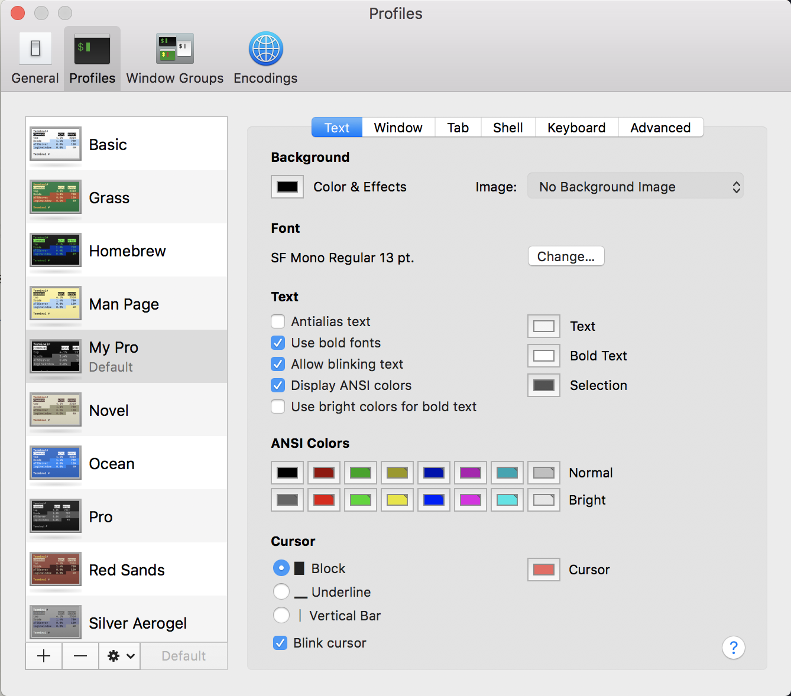
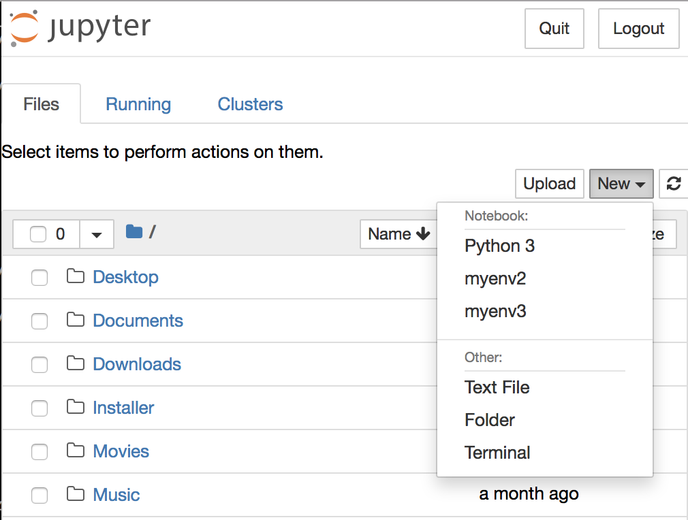

MacOS setup for new environment
=

## 1. Homebrew

The first thing to do is to install a package manager. I've been using
[homebrew](https://brew.sh/) rather than macport.

To install homebrew package manager, put bellow command onto Terminal.

    /usr/bin/ruby -e "$(curl -fsSL https://raw.githubusercontent.com/Homebrew/install/master/install)"

Then a prompt asks your administrator password, when you type in, it
progresses to downloading/installation step which takes some minuets.

## 2. Emacs install

I prefer the latest GNU Emacs. I used to download GNU Emacs on [this
site](https://emacsformacosx.com) or build the source on my machine,
but recently I found more simple way to get it. Using homebrew, you can
install Emacs almost without moving and clicking mouse! On the time I
wrote this guide, homebrew installed Emacs version 26.1 with following
command.

    brew install emacs --with-cocoa

## 3. Emacs configuration

I maintains Emacs configuration on [my github
repository](https://github.com/koojagyum/EmacsDot24). Type following
command on Terminal to get my emacs configuration.

    git clone https://github.com/koojagyum/EmacsDot24.git ~/.emacs.d

Once I get my Emacs configuration, I run Emacs and make "Keep in
Dock".

## 4. Terminal configuration

In default Terminal, option/alt key is not considered as meta key. We
need to change this behavior.

[Meta Key Problems](https://www.emacswiki.org/emacs/MetaKeyProblems#toc16)

Open Terminal' preference, go to profile tab, and copy profile named
'Pro'. Choose keyboard tab on the right side, check "Use option as
meta key", and the option/alt key should properly behave as meta
key.

(For Emacs, I do not change the behavior for Command key as I prefer to
use naive Control key.)

Here is "My Pro" profile's Text setting.

[OSX - How to auto Close Terminal window after the "exit" command executed.](https://stackoverflow.com/questions/5560167/osx-how-to-auto-close-terminal-window-after-the-exit-command-executed)

To close Terminal window(or tab) when "exit" command is executed, go
to profile setting, and select "Shell" tab on the top-right, then
select "Close if the shell exited clearly" on the middle of the
window.

## 5. Keyboard configuration

[Ctrl-Space on mac](http://chirokhan.blogspot.com/2013/01/ctrl-space-on-mac.html)

In Emacs, Ctrl-SPACE (C-SPS) is frequently used. On Mac, however,
C-SPC brings up the Spotlight search field window.

In the referenced page, it recommends two ways to fix this. I choose
(ii), remapping "Spotlight search field view" to something other than
C-SPC. Since I hardly use this feature, I just turn off the shortcut.

Go to "System Preference > Keyboard > Shortcuts > Spotlight". Make the
checkbox of "Spotlight" unchecked.

Then go to "Input Sources" tab on the left pane. Remap "Select the
previous input source" as "Command-SPC", and deselect "next"
checkbox. From now on, I should change input sources as "Command-SPC".

## 6. git global configuration

I set my name, email and editor as global config of git.

    git config --global user.name "Jagyum Koo"
    git config --global user.email "koojagyum@gmail.com"
    git config --global core.editor emacs

## 7. bash profile

Here're some part of my bash profile.

    # Aliases
    alias ls='ls -G'
    alias l='ls'
    alias ll='ls -al'
    alias bgkill='kill -9 $(jobs -p)'
    
    # Picked up from:
    # https://stackoverflow.com/questions/26554713/how-to-truncate-working-directory-in-prompt-to-show-first-and-last-folder
    PROMPT_PRE='\[\033[38;5;11m\]\u\[\033[38;5;15m\]@\h:\[\033[38;5;6m\]'
    PROMPT_POST='\[\033[38;5;15m\] '
    PWDTRIM1='$(pwd | sed -E -e "s|^$HOME|~|" -e '\''s|^([^/]*/[^/]*/).*(/[^/]*)|\1..\2|'\'')'
    PWDTRIM2='$(pwd | sed -E -e "s|^$HOME|~|" -e '\''s|^([^/]*/).*([^/]*/[^/]*/)|\1..\2|'\'')'
    PS1="${PROMPT_PRE}${PWDTRIM2}${PROMPT_POST}"

## 8. pip and virtualenv

Install pip in the system. MacOS contains Python 2.7 as default. So
you can install pip as following.

    sudo easy_install pip

Install virtualenv and virtualenvwrapper.

[Can't install virtualenvwrapper on OSX 10.11 El Capitan](https://stackoverflow.com/questions/32086631/cant-install-virtualenvwrapper-on-osx-10-11-el-capitan)

    sudo pip install virtualenv
    sudo pip install virtualenvwrapper --ignore-installed six

I create a directory to store my virtual environments for Python
libraries.

    mkdir ~/.virtualenvs

And I add following lines to .bash_profile in home folder.

    export WORKON_HOME=$HOME/.virtualenvs
    source /usr/local/bin/virtualenvwrapper.sh

Install Python3 to make a virtual environment for Python3. And also
install Python2 for later use.

    brew install python2
    brew install python3

Then create virtualenvs for python2 and python3.

    mkvirtualenv -p python2.7 myenv2
    mkvirtualenv -p python3 myenv3

## 9. Jupyter setting

I found the best article about Jutpyer & virtualenv setup.

[Jupyter에 virtualenv 커널 추가하기](https://songyunseop.github.io/post/2016/09/Using-Jupyter-inside-virtualenv/)

At first, install jupyter **in system environment**.

    sudo pip install jupyter

Run Jupyter to create runtime directory(~/Library/Jupyter/runtime),
then exit(Ctrl-c).

    jupyter notebook --no-browser

Install ipykernel **in each virtualenv**.

    workon myenv2
    pip install ipykernel
    workon myenv3
    pip install ipykernel
    deactivate

Check python paths of each virtualenv. The following shows about my case.

 * myenv2: /Users/koodev/.virtualenvs/myenv2/bin/python
 * myenv3: /Users/koodev/.virtualenvs/myenv3/bin/python

Create ipython kernels for each virtualenv.

    mkdir -p ~/Library/Jupyter/kernels/myenv2
    mkdir -p ~/Library/Jupyter/kernels/myenv3

Put kernel.json files onto each kernel directory.

myenv2 kernel(~/Library/Jupyter/kernels/myenv2/kernel.json).

    {
    "argv": ["/Users/koodev/.virtualenvs/myenv2/bin/python",
             "-m",
             "ipykernel",
             "-f",
             "{connection_file}"],
    "display_name": "myenv2",
    "language": "python"
    }

myenv3 kernel(~/Library/Jupyter/kernels/myenv3/kernel.json).

    {
    "argv": ["/Users/koodev/.virtualenvs/myenv3/bin/python",
             "-m",
             "ipykernel",
             "-f",
             "{connection_file}"],
    "display_name": "myenv3",
    "language": "python"
    }

I can check all the virtualenvs are listed in the notebook's kernel option.

